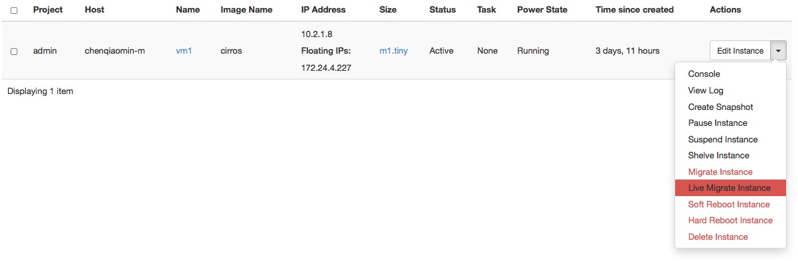

================
Manage instances
================

As an administrative user, you can manage instances for users in various
projects. You can view, terminate, edit, perform a soft or hard reboot,
create a snapshot from, and migrate instances. You can also view the
logs for instances or launch a VNC console for an instance.

For information about using the Dashboard to launch instances as an end
user, see the :doc:`OpenStack End User Guide </user/launch-instances>`.

Create instance snapshots
~~~~~~~~~~~~~~~~~~~~~~~~~

#. Log in to the Dashboard and select the :guilabel:`admin` project from the
   drop-down list.

#. On the :guilabel:`Admin` tab, open the :guilabel:`Compute` tab
   and click the :guilabel:`Instances` category.

#. Select an instance to create a snapshot from it. From the
   Actions drop-down list, select :guilabel:`Create Snapshot`.

#. In the :guilabel:`Create Snapshot` window, enter a name for the snapshot.

#. Click :guilabel:`Create Snapshot`. The Dashboard shows the instance snapshot
   in the :guilabel:`Images` category.

#. To launch an instance from the snapshot, select the snapshot and
   click :guilabel:`Launch`. For information about launching
   instances, see the
   :doc:`OpenStack End User Guide </user/launch-instances>`.

Control the state of an instance
~~~~~~~~~~~~~~~~~~~~~~~~~~~~~~~~

#. Log in to the Dashboard and select the :guilabel:`admin` project from the
   drop-down list.

#. On the :guilabel:`Admin` tab, open the :guilabel:`Compute` tab
   and click the :guilabel:`Instances` category.

#. Select the instance for which you want to change the state.

#. From the drop-down list in the Actions column,
   select the state.

   Depending on the current state of the instance, you can perform various
   actions on the instance. For example, pause, un-pause, suspend, resume,
   soft or hard reboot, or terminate (actions in red are dangerous).

   **Figure Dashboard — Instance Actions**

Track usage
~~~~~~~~~~~

Use the :guilabel:`Overview` category to track usage of instances
for each project.

You can track costs per month by showing meters like number of VCPUs,
disks, RAM, and uptime of all your instances.

#. Log in to the Dashboard and select the :guilabel:`admin` project from the
   drop-down list.

#. On the :guilabel:`Admin` tab, click the :guilabel:`Overview` category.

#. Select a month and click :guilabel:`Submit` to query the instance usage for
   that month.

#. Click :guilabel:`Download CSV Summary` to download a CSV summary.
