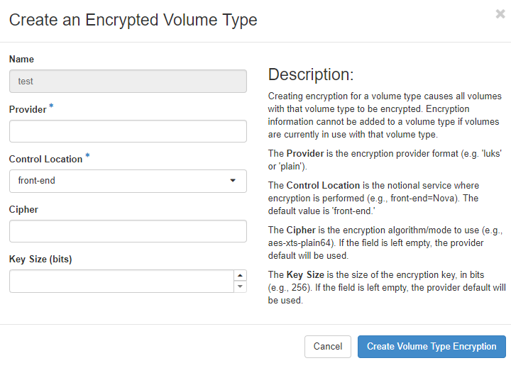

===============================
Manage volumes and volume types
===============================

Volumes are the Block Storage devices that you attach to instances to enable
persistent storage. Users can attach a volume to a running instance or detach
a volume and attach it to another instance at any time. For information about
using the dashboard to create and manage volumes as an end user, see the
:doc:`OpenStack End User Guide </user/manage-volumes>`.

As an administrative user, you can manage volumes and volume types for users
in various projects. You can create and delete volume types, and you can view
and delete volumes. Note that a volume can be encrypted by using the steps
outlined below.

.. _create-a-volume-type:

Create a volume type
~~~~~~~~~~~~~~~~~~~~

#. Log in to the dashboard and select the :guilabel:`admin`
   project from the drop-down list.

#. On the :guilabel:`Admin` tab, open the :guilabel:`Volume` tab.

#. Click the :guilabel:`Volume Types` tab, and click
   :guilabel:`Create Volume Type` button. In the
   :guilabel:`Create Volume Type` window, enter a name for the volume type.

#. Click :guilabel:`Create Volume Type` button to confirm your changes.

.. note::

   A message indicates whether the action succeeded.

Create an encrypted volume type
~~~~~~~~~~~~~~~~~~~~~~~~~~~~~~~

#. Create a volume type using the steps above for :ref:`create-a-volume-type`.

#. Click :guilabel:`Create Encryption` in the Actions column of the newly
   created volume type.

#. Configure the encrypted volume by setting the parameters below from
   available options (see table):

   Provider
     Specifies the encryption provider format.
   Control Location
     Specifies whether the encryption is from the front end (nova) or the
     back end (cinder).
   Cipher
     Specifies the encryption algorithm.
   Key Size (bits)
     Specifies the encryption key size.

#. Click :guilabel:`Create Volume Type Encryption`.

   **Encryption Options**

The table below provides a few alternatives available for creating encrypted
volumes.

+--------------------+-----------------------+----------------------------+
|      Encryption    |      Parameter        |   Comments                 |
|      parameters    |      options          |                            |
+====================+=======================+============================+
|   Provider         | luks                  |Allows easier import and    |
|                    | (Recommended)         |migration of imported       |
|                    |                       |encrypted volumes, and      |
|                    |                       |allows access key to be     |
|                    |                       |changed without             |
|                    |                       |re-encrypting the volume    |
+                    +-----------------------+----------------------------+
|                    | plain                 |Less disk overhead than     |
|                    |                       |LUKS                        |
|                    |                       |                            |
+--------------------+-----------------------+----------------------------+
| Control Location   | front-end             |The encryption occurs within|
|                    | (Recommended)         |nova so that the data       |
|                    |                       |transmitted over the network|
|                    |                       |is encrypted                |
|                    |                       |                            |
+                    +-----------------------+----------------------------+
|                    | back-end              |This could be selected if a |
|                    |                       |cinder plug-in supporting   |
|                    |                       |an encrypted back-end block |
|                    |                       |storage device becomes      |
|                    |                       |available in the future.    |
|                    |                       |TLS or other network        |
|                    |                       |encryption would also be    |
|                    |                       |needed to protect data as it|
|                    |                       |traverses the network       |
+--------------------+-----------------------+----------------------------+
|      Cipher        | aes-xts-plain64       |See NIST reference below    |
|                    | (Recommended)         |to see advantages*          |
+                    +-----------------------+----------------------------+
|                    | aes-cbc-essiv         |Note: On the command line,  |
|                    |                       |type 'cryptsetup benchmark' |
|                    |                       |for additional options      |
+--------------------+-----------------------+----------------------------+
|     Key Size (bits)| 256 (Recommended for  |Using this selection for    |
|                    | aes-xts-plain64 and   |aes-xts, the underlying key |
|                    | aes-cbc-essiv)        |size would only be 128-bits*|
+--------------------+-----------------------+----------------------------+

`*` Source `NIST SP 800-38E <https://nvlpubs.nist.gov/nistpubs/Legacy/SP/nistspecialpublication800-38e.pdf>`_

.. note::

   To see further information and CLI instructions, see
   `Create an encrypted volume type
   <https://docs.openstack.org/cinder/latest/configuration/block-storage/volume-encryption.html#create-an-encrypted-volume-type>`__
   in the OpenStack Block Storage Configuration Guide.

Delete volume types
~~~~~~~~~~~~~~~~~~~

When you delete a volume type, volumes of that type are not deleted.

#. Log in to the dashboard and select the :guilabel:`admin` project from
   the drop-down list.

#. On the :guilabel:`Admin` tab, open the :guilabel:`Volume` tab.

#. Click the :guilabel:`Volume Types` tab, select the volume type
   or types that you want to delete.

#. Click :guilabel:`Delete Volume Types` button.

#. In the :guilabel:`Confirm Delete Volume Types` window, click the
   :guilabel:`Delete Volume Types` button to confirm the action.

.. note::

   A message indicates whether the action succeeded.

Delete volumes
~~~~~~~~~~~~~~

When you delete an instance, the data of its attached volumes is not
destroyed.

#. Log in to the dashboard and select the :guilabel:`admin` project
   from the drop-down list.

#. On the :guilabel:`Admin` tab, open the :guilabel:`Volume` tab.

#. Click the :guilabel:`Volumes` tab, Select the volume or volumes
   that you want to delete.

#. Click :guilabel:`Delete Volumes` button.

#. In the :guilabel:`Confirm Delete Volumes` window, click the
   :guilabel:`Delete Volumes` button to confirm the action.

.. note::

   A message indicates whether the action succeeded.
