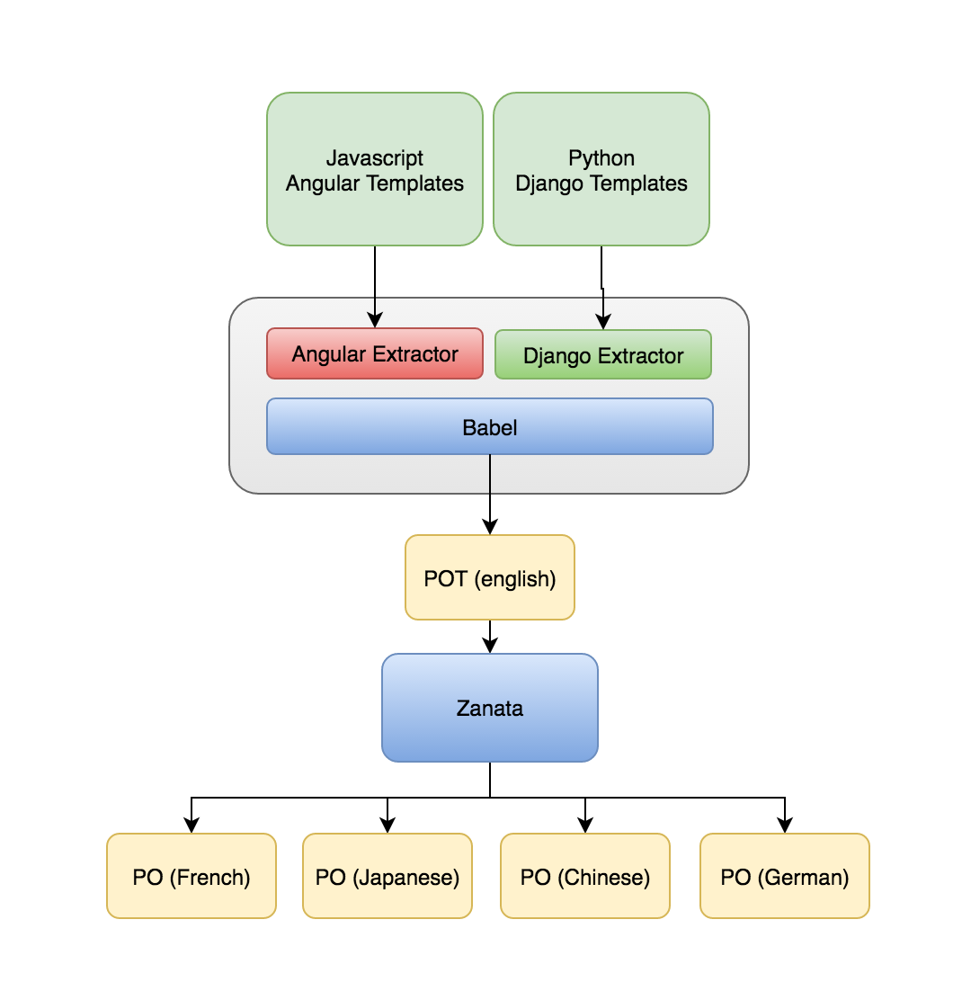
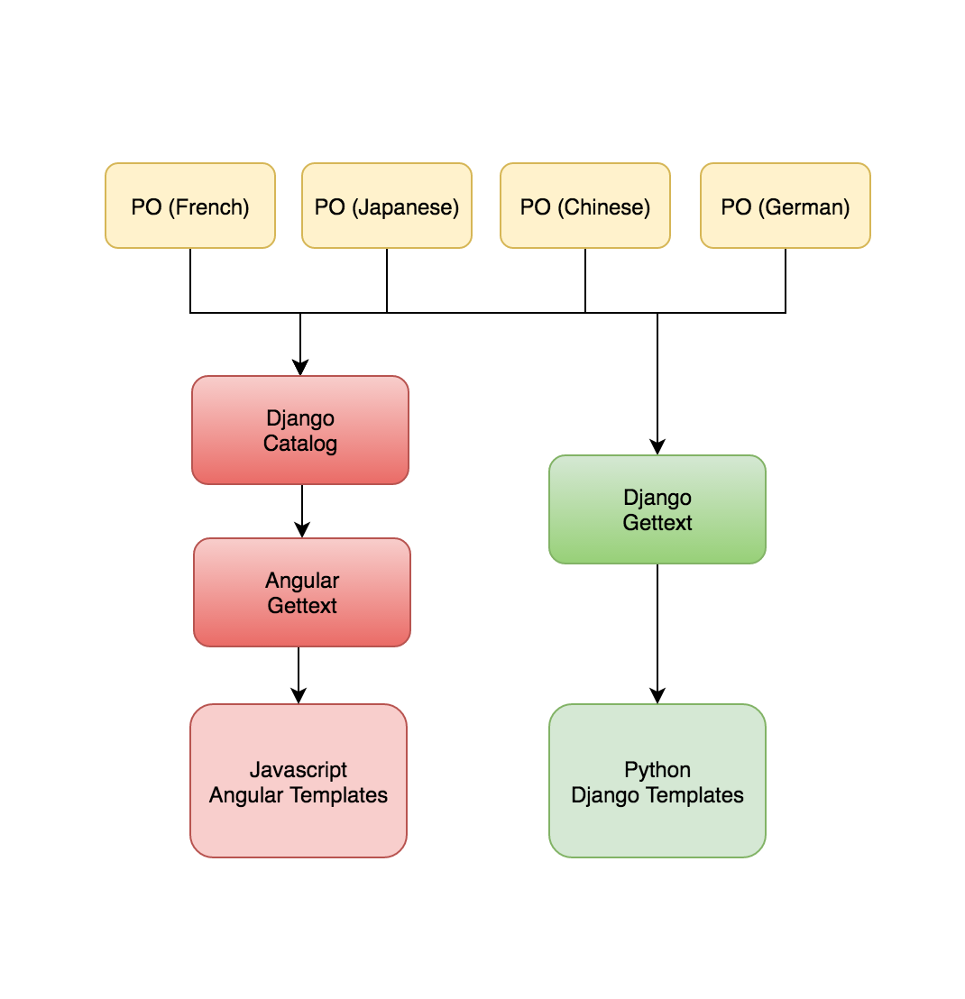

======================
Translation in Horizon
======================

What is the point of translating my code?
~~~~~~~~~~~~~~~~~~~~~~~~~~~~~~~~~~~~~~~~~

You introduced an awesome piece of code and revel in your glorious
accomplishment. Suddenly your world comes crashing down when a core hands you
a -1 because your code is not translated. What gives?

If you are writing software for a global audience, you must ensure that it is
translated so that other people around the world are able to use it. Adding
translation to your code is not that hard and a requirement for horizon.

If you are interested in contributing translations, you may want to investigate
`Zanata <https://translate.openstack.org>`_ and the
`upstream translations <https://docs.openstack.org/i18n/latest/>`_.
You can visit the internationalization project IRC channel **#openstack-i18n**,
if you need further assistance.

Overview and Architecture
~~~~~~~~~~~~~~~~~~~~~~~~~

You can skip this section if you are only interested in learning how to use
translation. This section explains the two main components to translation:
message extraction and message substitution. We will briefly go over what each
one does for translation as a whole.

Message Extraction
------------------

.. The source can be found at:
   https://drive.google.com/open?id=0B5nlaOV3OEj5MTNMdG9WV1RiVEU

Message extraction is the process of collecting translatable strings from the
code. The diagram above shows the flow of how messages are extracted and then
translated. Lets break this up into steps we can follow:

1. The first step is to mark untranslated strings so that the extractor is able
   to locate them. Refer to the guide below on how to use translation and what
   these markers look like.

2. Once marked, we can then run ``tox -e manage -- extract_messages``, which
   searches the codebase for these markers and extracts them into a Portable
   Object Template (POT) file. In horizon, we extract from both the ``horizon``
   folder and the ``openstack_dashboard`` folder. We use the AngularJS
   extractor for JavaScript and HTML files and the Django extractor for Python
   and Django templates; both extractors are Babel plugins.

3. To update the .po files, you can run ``tox -e manage -- update_catalog`` to
   update the .po file for every language, or you can specify a specific
   language to update like this: ``tox -e manage -- update_catalog de``. This
   is useful if you want to add a few extra translatabale strings for a
   downstream customisation.

.. note::

  When pushing code upstream, the only requirement is to mark the strings
  correctly. All creation of POT and PO files is handled by a daily upstream
  job. Further information can be found in the
  `translation infrastructure documentation
  <https://docs.openstack.org/i18n/latest/infra.html>`_.

Message Substitution
--------------------

.. The source can be found at:
   https://drive.google.com/open?id=0B5nlaOV3OEj5UHZCNmFGT0lPQVU

Message substitution is not the reverse process of message extraction. The
process is entirely different. Lets walk through this process.

* Remember those markers we talked about earlier? Most of them are functions
  like gettext or one of its variants. This allows the function to serve a dual
  purpose - acting as a marker and also as a replacer.

* In order for translation to work properly, we need to know the user's locale.
  In horizon, the user can specify the locale using the Settings panel. Once we
  know the locale, we know which Portable Object (PO) file to use. The PO file
  is the file we received from translators in the message extraction process.
  The gettext functions that we wrapped our code around are then able to
  replace the untranslated strings with the translated one by using the
  untranslated string as the message id.

* For client-side translation, Django embeds a corresponding Django message
  catalog. Javascript code on the client can use this catalog to do string
  replacement similar to how server-side translation works.

If you are setting up a project and need to know how to make it translatable,
please refer to `this guide
<https://docs.openstack.org/infra/manual/creators.html#enabling-translation-infrastructure>`_.

.. _making_strings_translatable:

Making strings translatable
~~~~~~~~~~~~~~~~~~~~~~~~~~~

To make your strings translatable, you need to mark it so that horizon can
locate and extract it into a POT file. When a user from another locale visits
your page, your string is replaced with the correct translated version.

In Django
---------

To translate a string, simply wrap one of the gettext variants around the
string. The examples below show you how to do translation for various
scenarios, such as interpolation, contextual markers and translation comments.

.. code-block:: python

  from django.utils.translation import pgettext
  from django.utils.translation import ugettext as _
  from django.utils.translation import ungettext

  class IndexView(request):

      # Single example
      _("Images")

      # Plural example
      ungettext(
          "there is %(count)d object",
          "there are %(count)d objects",
          count) % { "count": count }

      # Interpolated example
      mood = "wonderful"
      output = _("Today is %(mood)s.") % mood

      # Contextual markers
      pgettext("the month name", "May")

      # Translators: This message appears as a comment for translators!
      ugettext("Welcome translators.")

.. note::

  In the example above, we imported ``ugettext`` as ``_``. This is a common
  alias for gettext or any of its variants.

In Django templates
-------------------

To use translation in your template, make sure you load the i18n module. To
translate a line of text, use the ``trans`` template tag. If you need to
translate a block of text, use the ``blocktrans`` template tag.

Sometimes, it is helpful to provide some context via the ``comment`` template
tag. There a number of other tags and filters at your disposal should you need
to use them. For more information, see the
`Django docs <https://docs.djangoproject.com/en/1.8/topics/i18n/translation/>`_

.. code-block:: django

    
    
    
      
    

    
      Translators: Images is an OpenStack resource
      
        There are {{ amount }} images available for display.
      
    

In JavaScript
-------------

The Django message catalog is injected into the front-end. The gettext function
is available as a global function so you can just use it directly. If you are
writing AngularJS code, we prefer that you use the gettext service, which is
essentially a wrapper around the gettext function.

.. code-block:: javascript

    Angular
      .module(myModule)
      .controller(myCtrl);

    myCtrl.$inject = [
      "horizon.framework.util.i18n.gettext"
    ];

    function myCtrl(gettext) {
      var translated = gettext("Images");
    }

.. warning::

  For localization in AngularJS files, use the AngularJS service
  ``horizon.framework.util.i18n.gettext``. Ensure that the injected dependency
  is named ``gettext`` or ``nggettext``. If you do not do this, message
  extraction will not work properly!

In AngularJS templates
-----------------------

To use translation in your AngularJS template, use the translate tag or the
translate filter. Note that we are using
`angular-gettext <https://angular-gettext.rocketeer.be/>`_
for message substitution but not for message extraction.

.. code-block:: html

    <translate>Directive example</translate>
    
Attribute example

    
Interpolated {{example}}

    {$ 'Filter example'| translate $}

    
      This <em>is</em> a <strong>bad</strong> example
      because it contains HTML and makes it harder to translate.
      However, it will still translate.
    

.. note::

  The annotations in the example above are guaranteed to work. However, not all of
  the angular-gettext annotations are supported because we wrote our own custom
  babel extractor. If you need support for the annotations, ask on IRC in the
  **#openstack-horizon** room or report a bug. Also note that you should avoid embedding
  HTML fragments in your texts because it makes it harder to translate. Use your
  best judgement if you absolutely need to include HTML.

.. _pseudo_translation:

Pseudo translation tool
~~~~~~~~~~~~~~~~~~~~~~~

The pseudo translation tool can be used to verify that code is ready to be
translated. The pseudo tool replaces a language's translation with a complete,
fake translation. Then you can verify that your code properly displays fake
translations to validate that your code is ready for translation.

Running the pseudo translation tool
-----------------------------------

#. Make sure your .pot files are up to date

   .. code-block:: console

     $ tox -e manage -- extract_messages

#. Run the pseudo tool to create pseudo translations. This example replaces
   the German translation with a pseudo translation

   .. code-block:: console

     $ tox -e manage -- update_catalog de --pseudo

#. Compile the catalog

   .. code-block:: console

     $ tox -e manage -- compilemessages

#. Run your development server.

   .. code-block:: console

     $ tox -e runserver

#. Log in and change to the language you pseudo translated.

It should look weird. More specifically, the translatable segments are going
to start and end with a bracket and they are going to have some added
characters. For example, "Log In" will become "[~Log In~您好яшçあ]"
This is useful because you can inspect for the following, and consider if your
code is working like it should:

* If you see a string in English it's not translatable. Should it be?
* If you see brackets next to each other that might be concatenation. Concatenation
  can make quality translations difficult or impossible. See
  `Use string formatting variables, never perform string concatenation
  <https://wiki.openstack.org/wiki/I18n/TranslatableStrings#Use_string_formating_variables.2C_never_perform_string_concatenation>`_
  for additional information.
* If there is unexpected wrapping/truncation there might not be enough
  space for translations.
* If you see a string in the proper translated language, it comes from an
  external source. (That's not bad, just sometimes useful to know)
* If you get new crashes, there is probably a bug.

Don't forget to remove any pseudo translated ``.pot`` or ``.po`` files.
Those should **not** be submitted for review.
