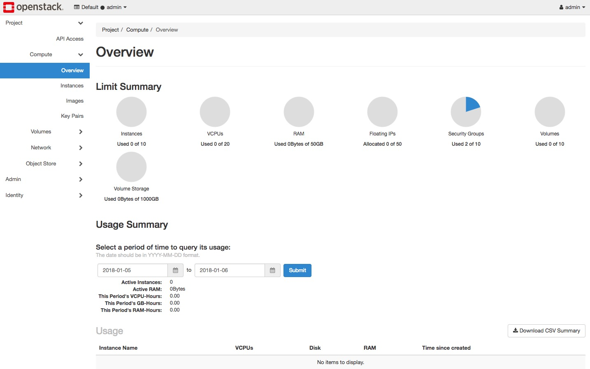
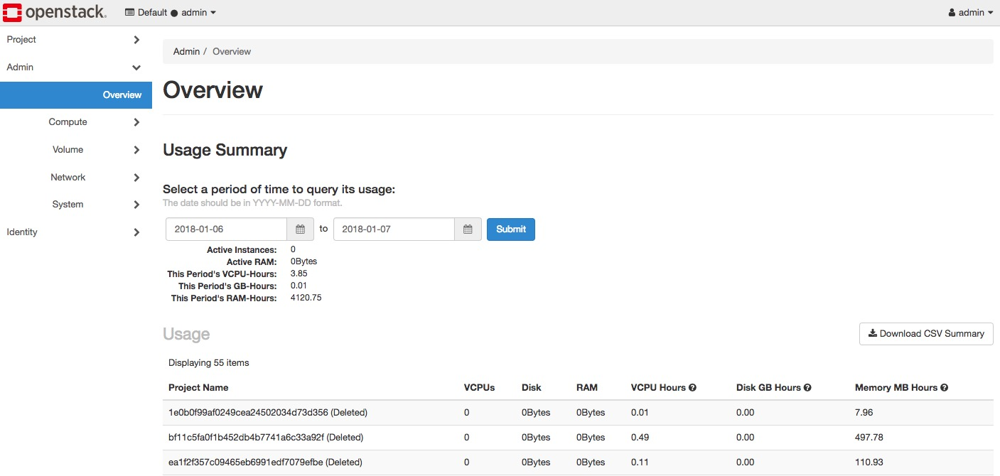
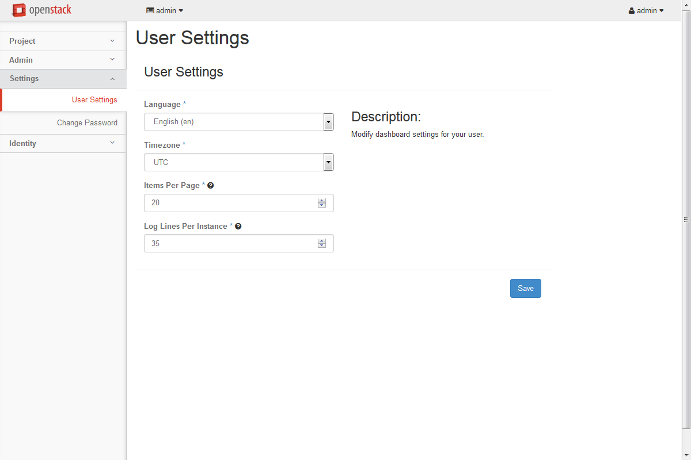

=======================
Log in to the dashboard
=======================

The dashboard is generally installed on the controller node.

#. Ask the cloud operator for the host name or public IP address from
   which you can access the dashboard, and for your user name and
   password. If the cloud supports multi-domain model, you also need to
   ask for your domain name.

#. Open a web browser that has JavaScript and cookies enabled.

   .. note::

      To use the Virtual Network Computing (VNC) client for the dashboard,
      your browser must support HTML5 Canvas and HTML5 WebSockets. The VNC
      client is based on noVNC. For details, see `noVNC: HTML5 VNC
      Client <https://github.com/novnc/noVNC/blob/master/README.md>`__.
      For a list of supported browsers, see `Browser
      support <https://github.com/novnc/noVNC#browser-requirements>`__.

#. In the address bar, enter the host name or IP address for the
   dashboard, for example, ``https://ipAddressOrHostName/``.

   .. note::

      If a certificate warning appears when you try to access the URL for
      the first time, a self-signed certificate is in use, which is not
      considered trustworthy by default. Verify the certificate or add an
      exception in the browser to bypass the warning.

#. On the :guilabel:`Log In` page, enter your user name and password, and
   click :guilabel:`Sign In`. If the cloud supports multi-domain model, you
   also need to enter your domain name.

   The top of the window displays your user name. You can also access the
   :guilabel:`Settings` tab (:ref:`dashboard-settings-tab`) or sign out
   of the dashboard.

   The visible tabs and functions in the dashboard depend on the access
   permissions, or roles, of the user you are logged in as.

   * If you are logged in as an end user, the :guilabel:`Project` tab
     (:ref:`dashboard-project-tab`) and :guilabel:`Identity` tab
     (:ref:`dashboard-identity-tab`) are displayed.

   * If you are logged in as an administrator, the :guilabel:`Project` tab
     (:ref:`dashboard-project-tab`) and :guilabel:`Admin` tab
     (:ref:`dashboard-admin-tab`) and :guilabel:`Identity` tab
     (:ref:`dashboard-identity-tab`) are displayed.

.. _dashboard-project-tab:

OpenStack dashboard — Project tab
~~~~~~~~~~~~~~~~~~~~~~~~~~~~~~~~~

Projects are organizational units in the cloud and are also known as
tenants or accounts. Each user is a member of one or more projects.
Within a project, a user creates and manages instances.

From the :guilabel:`Project` tab, you can view and manage the resources in a
selected project, including instances and images. You can select the project
from the drop-down menu at the top left. If the cloud supports multi-domain
model, you can also select the domain from this menu.

   **Figure: Project tab**

From the :guilabel:`Project` tab, you can access the following categories:

* :guilabel:`API Access`: View API endpoints.

Compute tab
-----------

* :guilabel:`Overview`: View reports for the project.

* :guilabel:`Instances`: View, launch, create a snapshot from, stop, pause,
  or reboot instances, or connect to them through VNC.

* :guilabel:`Images`: View images and instance snapshots created by project
  users, plus any images that are publicly available. Create, edit, and
  delete images, and launch instances from images and snapshots.

* :guilabel:`Key Pairs`: View, create, edit, import, and delete key pairs.

Volume tab
-----------

* :guilabel:`Volumes`: View, create, edit, and delete volumes.

* :guilabel:`Backups`: View, create, edit, and delete backups.

* :guilabel:`Snapshots`: View, create, edit, and delete volume snapshots.

* :guilabel:`Consistency Groups`: View, create, edit, and delete
  consistency groups.

* :guilabel:`Consistency Group Snapshots`: View, create, edit, and
  delete consistency group snapshots.

Network tab
-----------

* :guilabel:`Network Topology`: View the network topology.

* :guilabel:`Networks`: Create and manage public and private networks.

* :guilabel:`Routers`: Create and manage routers.

* :guilabel:`Security Groups`: View, create, edit, and delete security
  groups and security group rules..

* :guilabel:`Floating IPs`: Allocate an IP address to or release it
  from a project.

Object Store tab
----------------

* :guilabel:`Containers`: Create and manage containers and objects.

.. _dashboard-admin-tab:

OpenStack dashboard — Admin tab
~~~~~~~~~~~~~~~~~~~~~~~~~~~~~~~

Administrative users can use the :guilabel:`Admin` tab to view usage and to
manage instances, volumes, flavors, images, networks, and so on.

   **Figure: Admin tab**

From the :guilabel:`Admin` tab, you can access the following category
to complete these tasks:

Overview tab
------------

* :guilabel:`Overview`: View basic reports.

Compute tab
-----------

* :guilabel:`Hypervisors`: View the hypervisor summary.

* :guilabel:`Host Aggregates`: View, create, and edit host aggregates.
  View the list of availability zones.

* :guilabel:`Instances`: View, pause, resume, suspend, migrate, soft or hard
  reboot, and delete running instances that belong to users of some, but not
  all, projects. Also, view the log for an instance or access an instance
  through VNC.

* :guilabel:`Flavors`: View, create, edit, view extra specifications for,
  and delete flavors. A flavor is the size of an instance.

* :guilabel:`Images`: View, create, edit properties for, and delete custom
  images.

Volume tab
----------

* :guilabel:`Volumes`: View, create, manage, and delete volumes.

* :guilabel:`Snapshots`: View, manage, and delete volume snapshots.

* :guilabel:`Volume Types`: View, create, manage, and delete volume types.

Network tab
-----------

* :guilabel:`Networks`: View, create, edit properties for, and delete
  networks.

* :guilabel:`Routers`: View, create, edit properties for, and delete routers.

* :guilabel:`Floating IPs`: Allocate an IP address for a project or release it.

System tab
----------

* :guilabel:`Defaults`: View default quota values. Quotas are hard-coded in
  OpenStack Compute and define the maximum allowable size and number of
  resources.

* :guilabel:`Metadata Definitions`: Import namespace and view the metadata
  information.

* :guilabel:`System Information`: Use the following tabs to view the service
  information:

  * :guilabel:`Services`: View a list of the services.

  * :guilabel:`Compute Services`: View a list of all Compute services.

  * :guilabel:`Block Storage Services`: View a list of all Block Storage
    services.

  * :guilabel:`Network Agents`: View the network agents.

.. _dashboard-identity-tab:

OpenStack dashboard — Identity tab
~~~~~~~~~~~~~~~~~~~~~~~~~~~~~~~~~~

.. figure:: figures/dashboard_identity_tab.png
   :width: 100%

   **Figure:Identity tab**

* :guilabel:`Projects`: View, create, assign users to, remove users from,
  and delete projects.

* :guilabel:`Users`: View, create, enable, disable, and delete users.

.. _dashboard-settings-tab:

OpenStack dashboard — Settings tab
~~~~~~~~~~~~~~~~~~~~~~~~~~~~~~~~~~

   **Figure:Settings tab**

Click the :guilabel:`Settings` button from the user drop down menu at the
top right of any page, you will see the :guilabel:`Settings` tab.

* :guilabel:`User Settings`: View and manage dashboard settings.

* :guilabel:`Change Password`: Change the password of the user.
